<div align="center">

# ⚡ Mathmon Battle League

**Catch monsters. Win battles. Get faster at maths.**

A creature-collecting card battler where every attack is powered by solving a
maths problem — built for a smart seven-year-old who likes trading cards, plays
chess, and is good at numbers.

[](https://vercel.com/import/git?s=https://github.com/pfeilbr/pokemon-game)

One click, no environment variables, no configuration.

</div>

---

## What it is

You pick a partner creature, choose an opponent, and fight. Attacking means
answering a maths question: get it right and you hit hard, answer _fast_ and you
crit, chain answers and you build a combo. Win, and one last question decides
whether you catch the creature for your album.

It is not a quiz with a monster drawn next to it. The maths _is_ the combat
system, and the strategy around it is real:

- **A six-element wheel** where each element beats two others and loses to two
  others — provably symmetric, so no element is secretly best and counter-picking
  actually matters. The full chart is shown before you commit to a fight.
- **Four moves every turn.** A quick move asks an easier question for less
  damage; a strong move asks a harder one for more. The special costs a full
  charge meter and hits enormously. Mend trades charge for health.
- **Every matchup is winnable** — even the worst one on the wheel, where you deal
  half damage and take double. It just needs you to bank charge and time the
  special. That is the fight that teaches counter-picking.
- **Difficulty adapts.** Ten tiers from adding-to-20 up to two-step expressions,
  moving one step at a time on a rolling window of your last eight answers.
  Promotion needs accuracy _and_ speed, so a lucky streak won't fling a
  seven-year-old into fractions.

Progress is tracked properly: XP and trainer levels, an 18-creature album,
partner evolution at levels 4 and 8, twelve badges, daily streaks, and a
per-skill accuracy and speed breakdown that doubles as the parent view.

Everything is in **English and Chinese**, including all 18 creature names.

---

## Screens

### Starting out

Pick a name, pick a partner. No account, no setup — you are playing in about
fifteen seconds.

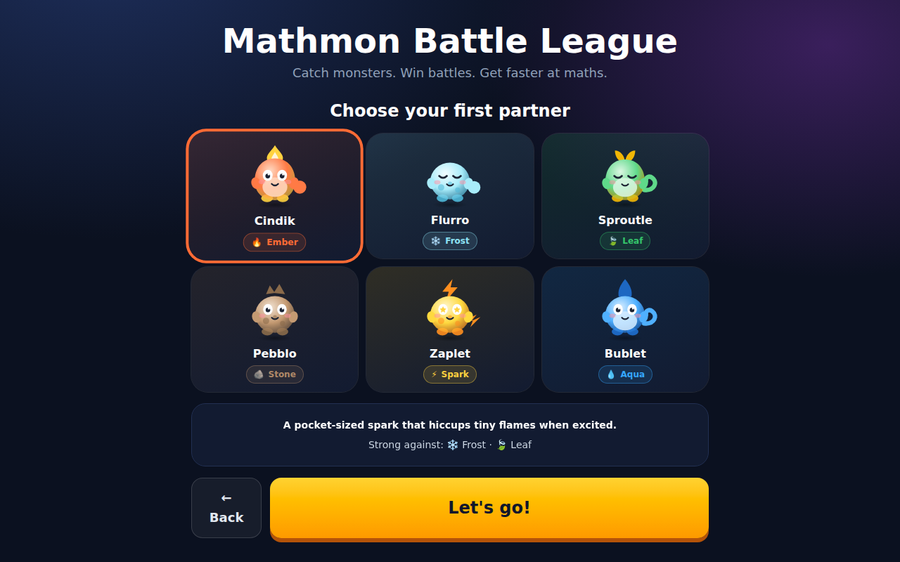

### Home

Your partner, your level, your maths tier, your album progress and your streak.

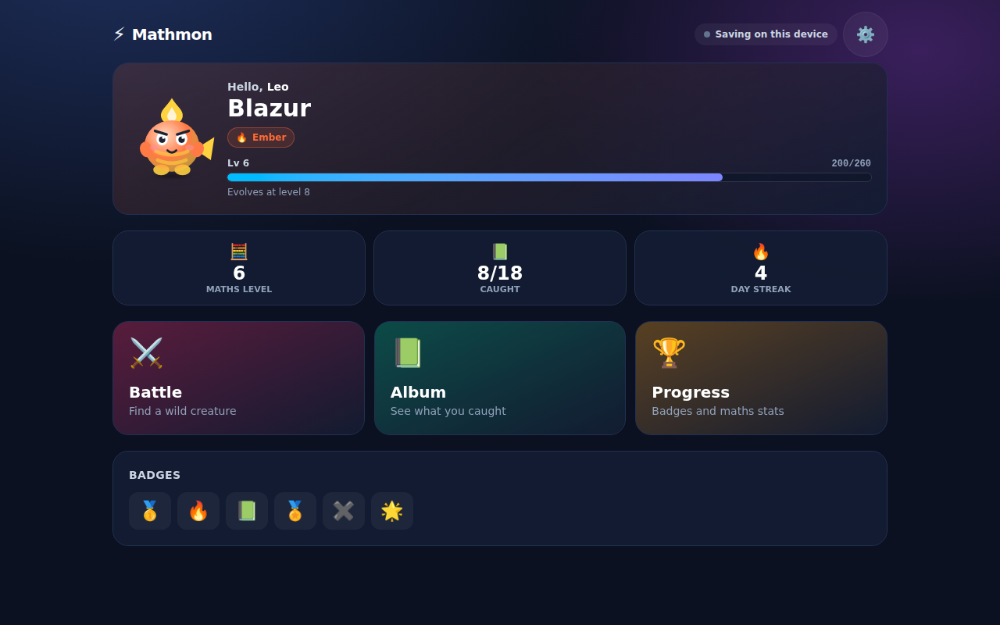

### Choosing an opponent

Each candidate is labelled **Good / Tough / Even**, with the exact multipliers
you will deal and take. The full type chart expands underneath. The strategy is
meant to be planned, not discovered by losing.

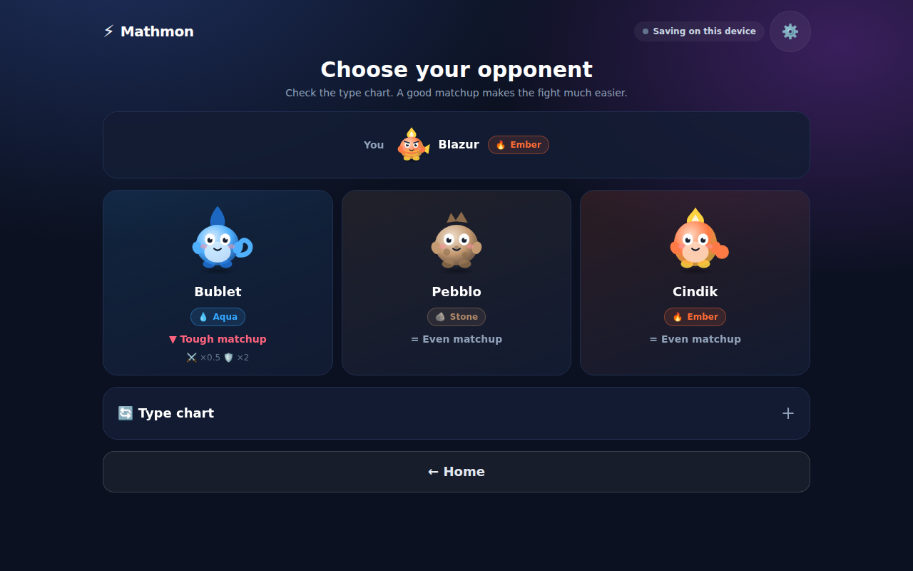

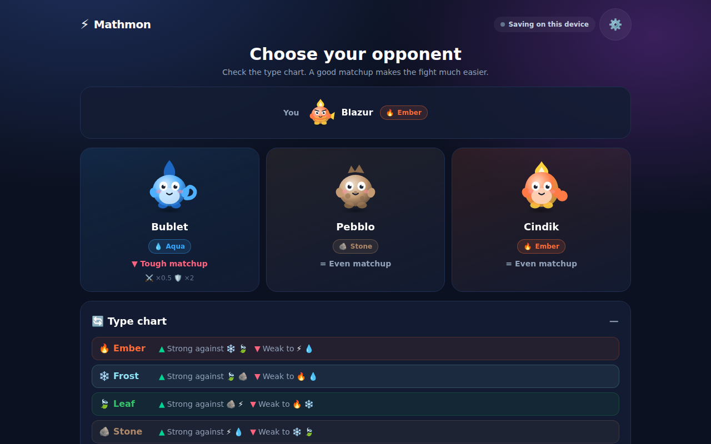

### Battle

Pick a move — note the special glowing once the charge meter fills.

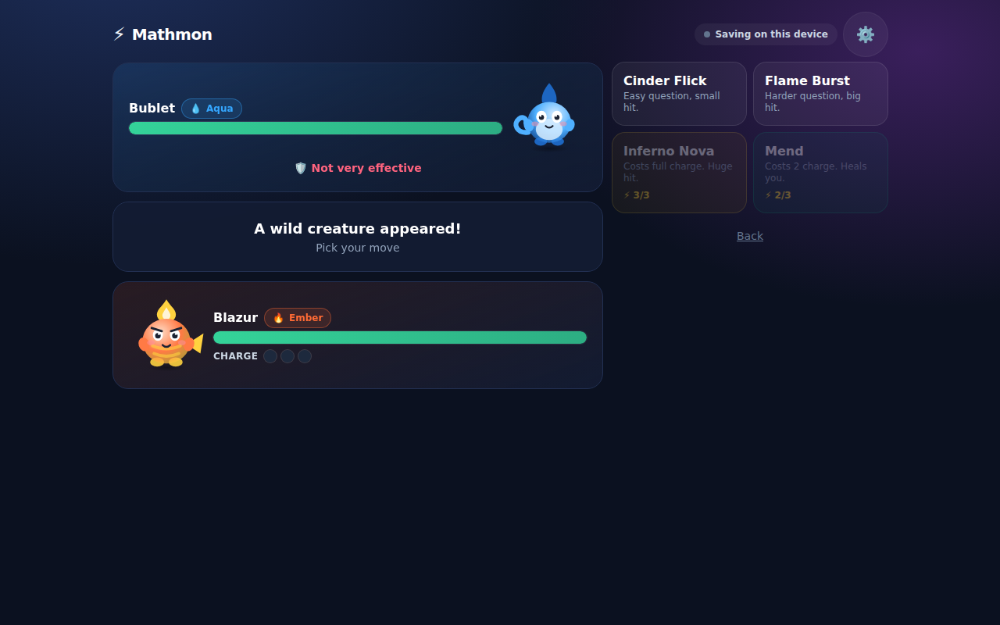

Then answer. The on-screen keypad means no OS keyboard ever covers the fight on
a tablet, and it is why every answer in the game is a whole number. The meter
under the question is the speed bonus draining away — answer fast for extra
damage and a critical hit. It is pure upside: when it empties it just says
"take your time", and the hit lands normally.

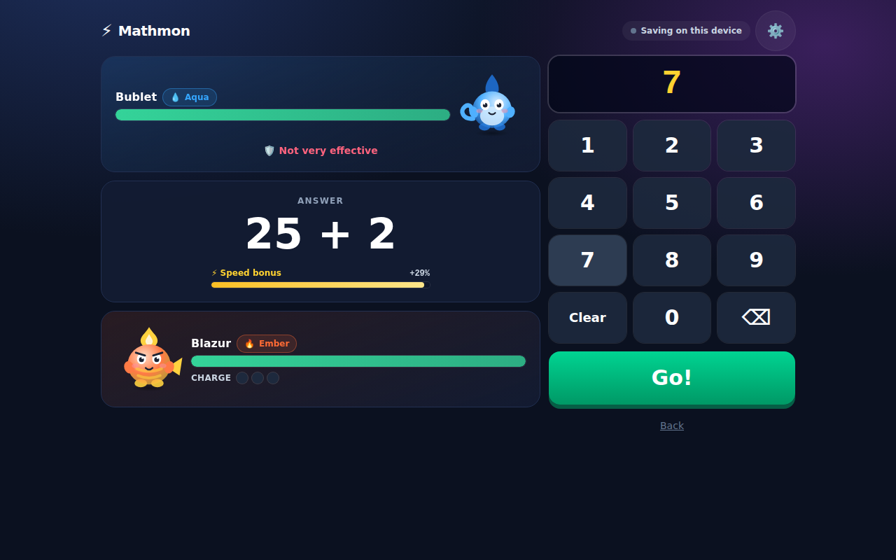

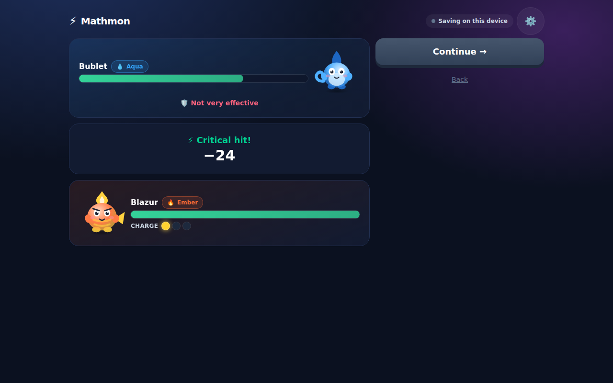

### Winning

A final question decides the catch — so the collection rewards skill rather than
a dice roll. XP, level-ups, evolutions and new badges are all called out by name.

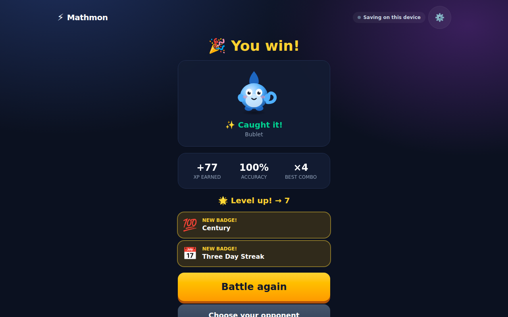

### Album

All 18 creatures across six evolution lines. Un-caught ones stay silhouetted.

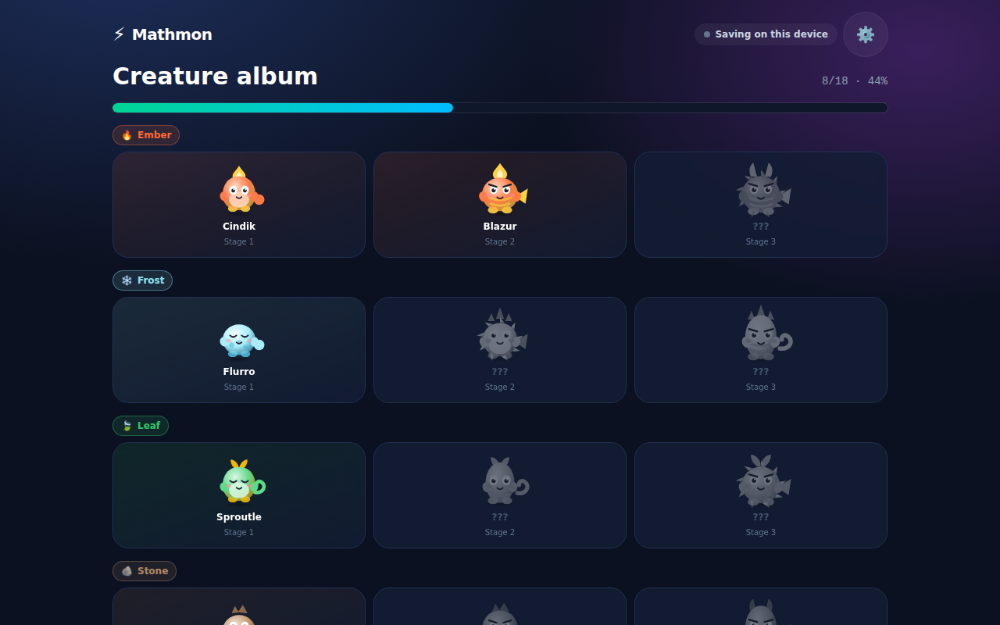

### Progress

Badges, and a per-skill breakdown of accuracy, average time and attempt count.

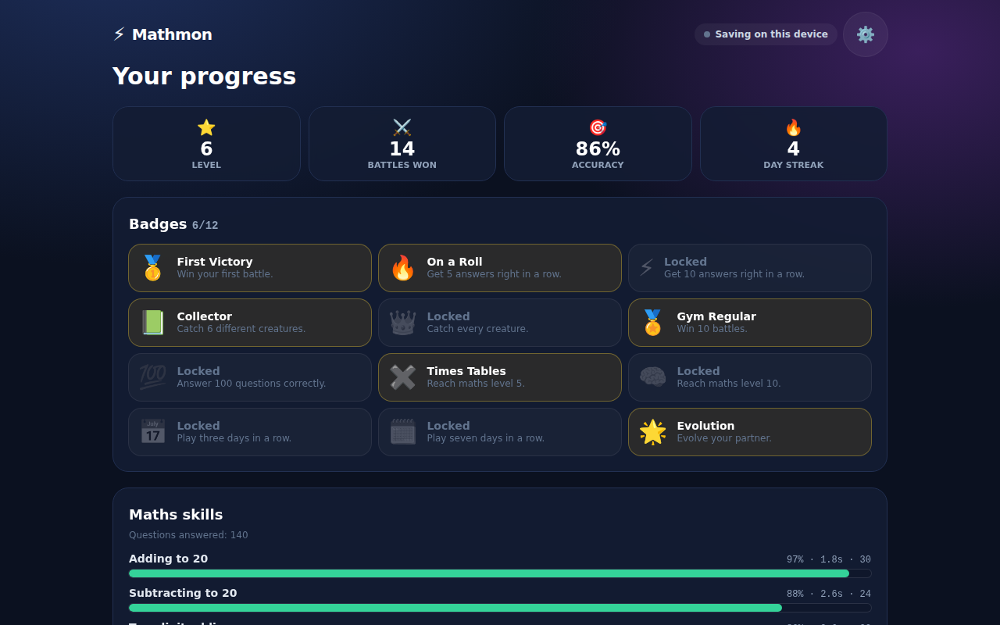

### Chinese

The whole interface, including every creature name.


### On a phone

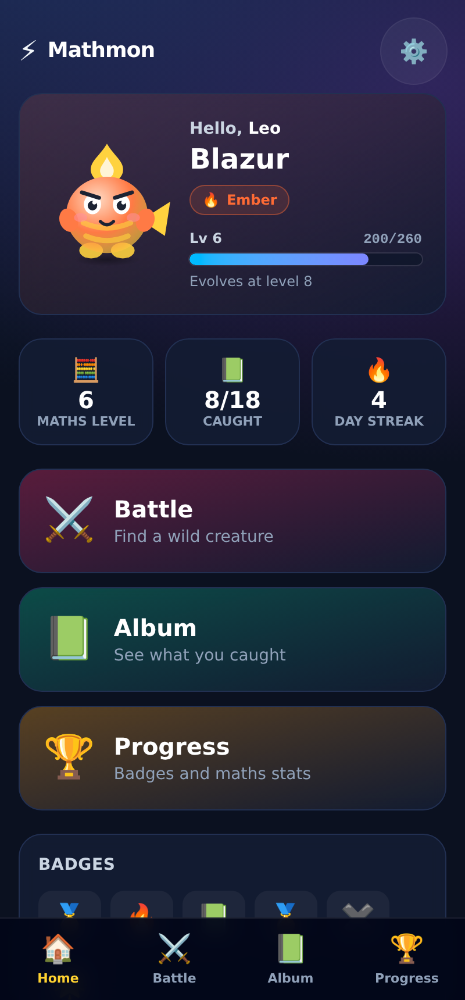
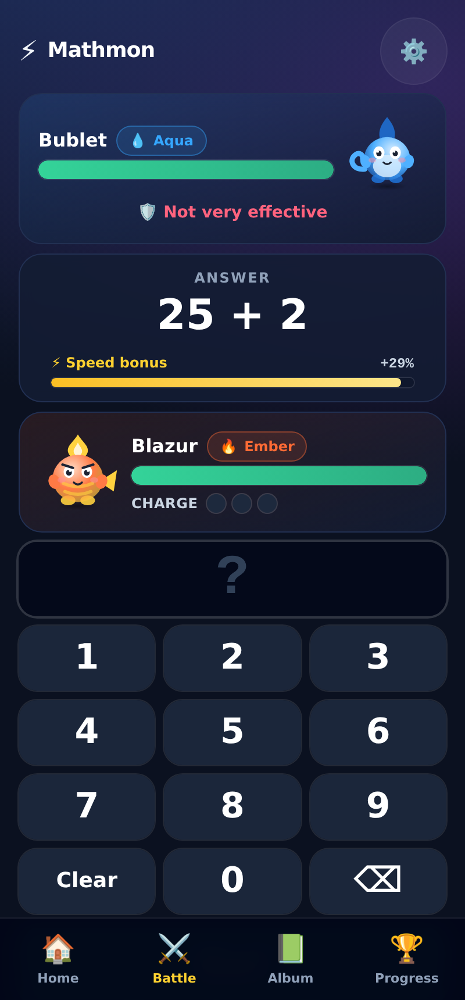

### Signing in

Optional, and only offered when the deployment has a database attached.

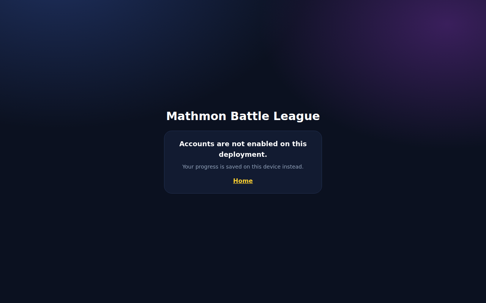

---

## Deploying to Vercel

The app runs with **no environment variables at all**, so this is genuinely a
two-minute job.

**[→ Import this repo into Vercel](https://vercel.com/import/git?s=https://github.com/pfeilbr/pokemon-game)** —
opens the import screen with the repository already filled in. Click **Deploy**,
then open the URL and play.

That link imports _this_ repository, so every later push redeploys
automatically. (The generic [vercel.com/new](https://vercel.com/new) works too;
just pick `pokemon-game` from the list.)

With no configuration, progress saves in the browser on that device. That is a
complete, playable game — accounts are an upgrade, not a requirement.

### Adding accounts and cross-device sync (optional)

1. In your Vercel project → **Storage** → **Create Database** → **Neon**
   (Postgres). The free plan is plenty. Vercel injects `DATABASE_URL`
   automatically.
2. Redeploy.

That is it — sign-in appears, the schema creates itself on first use, and
progress follows the player between devices. Sign-up is a trainer name plus a
**4-digit PIN**, because a seven-year-old can type four digits unaided but
cannot manage a parent's Google password.

Recommended once it works: set `AUTH_SECRET` to `openssl rand -base64 32` in
**Settings → Environment Variables**. Without it the session key is derived from
the database URL, which works but ties the two secrets together.

### Adding Google sign-in (optional)

Create an OAuth 2.0 Client ID (type: Web) in the
[Google Cloud Console](https://console.cloud.google.com/apis/credentials), add
`https://<your-domain>/api/auth/google/callback` as an authorised redirect URI,
then set `GOOGLE_CLIENT_ID` and `GOOGLE_CLIENT_SECRET` and redeploy. The Google
button appears on its own.

---

## Running locally

```bash
npm install
npm run dev          # http://localhost:3000
```

```bash
npm test             # 192 unit tests
npm run build        # required before E2E
npm run test:e2e     # 44 E2E tests across desktop + mobile viewports
npm run test:all     # typecheck + unit + E2E
```

The account layer talks SQL, so it is covered by integration tests against a
real Postgres rather than by mocks. They skip themselves unless you offer a
database, which keeps the default run dependency-free:

```bash
export TEST_DATABASE_URL='postgres://postgres@127.0.0.1:5432/postgres?sslmode=disable'
npm test             # +18 Postgres integration tests
npm run test:e2e     # +8 signed-in browser tests, incl. cross-device sync
```

CI runs both, so the sign-in path is verified before it ever reaches a real
deployment.

---

## How it is built

Next.js 16 (App Router) · React 19 · TypeScript (strict, `noUncheckedIndexedAccess`)
· Tailwind CSS v4 · Postgres · Vitest · Playwright.

**No image, font, or audio assets ship with this app.** All 18 creatures are
procedurally drawn SVG generated from a data spec, and every sound effect is
synthesised with the Web Audio API. Nothing is fetched at runtime, so the game
loads instantly and works offline.

The game rules live in `src/lib/game/` as pure, seeded, deterministic
functions — no React, no clock, no I/O. Randomness comes from explicit seeds and
the current time is passed _into_ the battle reducer. That means a battle
replays exactly in a test, can be serialised mid-fight, and lets balance be
**proven** rather than eyeballed: the suite simulates all 36 starter matchups and
asserts properties about the outcomes.

Two real design bugs were caught that way and are now regression-guarded:

- With a type advantage you could once win a battle while answering **every**
  question wrong — the 2× multiplier was amplifying the consolation hit past the
  opponent's damage output. A miss is now a flat chip with no type, combo or
  speed bonus, so maths is strictly the win condition.
- The worst matchup on the wheel was unwinnable with naive play. It is winnable
  now by banking charge for the special — so the special is highlighted the
  moment it becomes affordable.

The E2E tests genuinely play the game: they read each question off the screen,
work out the answer independently of the game's own generator, and tap it in on
the keypad. The screenshots above are captured by that same suite, so they
cannot drift from the real UI. The signed-in path is exercised against a real
Postgres, up to and including logging in on a second browser context and
finding the badge earned on the first.

See [CLAUDE.md](CLAUDE.md) for architecture and contribution notes.

---

## A note on Pokémon

This is a Pokémon-_style_ game, not a Pokémon game. Every creature, name and
piece of art here is original and drawn by code in this repository. No Nintendo
or The Pokémon Company assets, names, or trademarks are used or redistributed.
