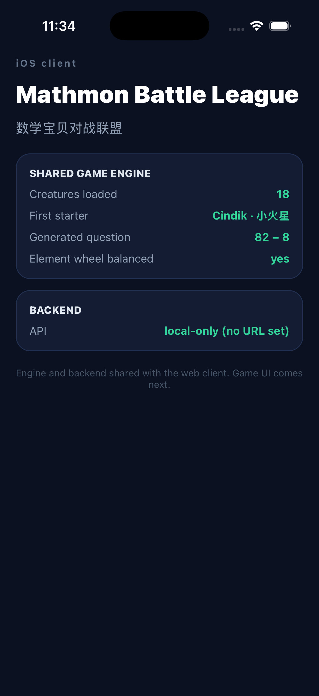

# Mathmon — iOS client

React Native on Expo SDK 57. Shares the web app's game engine rather than
reimplementing it.

## The shared engine is the point

`src/lib/game/` at the repository root is pure TypeScript: no React, no DOM, no
Node APIs, no `Math.random`, no `Date.now` inside the rules. That is what makes
it portable, so this client imports **the same modules** the web client uses:

```
src/lib/game/          ← one copy of the rules
├── consumed by src/app/        (Next.js, web)
└── consumed by mobile/src/engine.ts  (React Native, iOS)
```

A balance fix or a new creature reaches both clients at once, and the engine
tests at the repository root cover this client too.

Two pieces of plumbing make it work:

- **`metro.config.js`** declares `../src/lib` in `watchFolders`, because Metro
  only watches its own project root. Module resolution is pinned to
  `mobile/node_modules` so shared files cannot pick up a second copy of React
  from the web app's dependency tree.
- **`src/engine.ts`** is the only file that knows the path across the directory
  boundary. Everything else imports from it.

`src/engine.test.ts` guards the seam, including a check that no shared module
has grown a Node or browser dependency that would break under Hermes.

## Commands

```bash
npm install
npm run typecheck
npm test           # shared-engine seam + API client contract
npm run bundle     # real Metro bundle for iOS, runs anywhere including Linux
npm run ios        # needs macOS + Xcode
```

`npm run bundle` is the most useful check off a Mac: it compiles the whole app,
shared engine included, to Hermes bytecode and fails on any bad import.

## Backend

Points at the same Next.js API as the web client, so accounts and saved
progress are shared rather than forked. The base URL is build-time
configuration, never hardcoded:

```bash
EXPO_PUBLIC_API_URL=https://your-deployment.vercel.app npm run bundle
```

With none set the app runs local-only, mirroring how the web app behaves with
no database attached.

## Building and signing

All macOS work happens on GitHub Actions (`.github/workflows/ios.yml`), not on
a developer machine.

**Today, with no credentials at all**, the `simulator` job on `macos-26` runs
`expo prebuild`, `pod install` and `xcodebuild`, then boots a simulator to
install, launch and screenshot the app. Simulator builds need no Apple
Developer account, so this is free and runs on every push.

Three things about that job are load-bearing, and each one was added after a
green run that had proven nothing:

- **It builds Release, not Debug.** React Native's bundle script phase skips
  bundling for a simulator Debug build, because it assumes Metro is serving on
  localhost. Nothing serves in CI, so a Debug build ships an app containing no
  JavaScript. It installs, launches, stays alive, and displays the "No script
  URL provided" redbox. Release embeds the Hermes bytecode bundle, which is
  also what actually ships.
- **It asserts `main.jsbundle` is inside the `.app`** before launching, which
  is the direct guard against the above.
- **It reads the pixels back.** `scripts/assert-screenshot-text.swift` runs
  Vision OCR over the screenshot and requires the app's own strings to be on
  it. "The process is still alive" is a weak claim: a redbox is alive, and so
  is a blank screen. Only the OCR distinguishes *running* from *working*.

The runner image matters: Expo SDK 57 ships a Swift package declaring
`swift-tools-version 6.2`, so the build needs Xcode 26 or newer. On the
`macos-15` image (Xcode 16.4 / Swift 6.1) SwiftPM refuses to resolve it, six
minutes into the build, inside a CocoaPods script phase. The workflow now
asserts the Swift version up front so that failure is immediate and legible.

**For a signed build**, add an `EXPO_TOKEN` repository secret
([expo.dev](https://expo.dev) → account → access tokens). The `signed-build`
job skips itself until that exists. EAS provisions and stores the certificate
and provisioning profile itself, so **no `.p12`, no private key and no
provisioning profile is ever committed to this repository**.

Before the first signed build you also need:

| What                               | Where                                         | Why                                                                              |
| ---------------------------------- | --------------------------------------------- | -------------------------------------------------------------------------------- |
| Apple Developer Program membership | developer.apple.com                           | Required for any signed build                                                    |
| Bundle identifier                  | `app.json` → `ios.bundleIdentifier`           | Currently `com.pfeilbr.mathmon`; change before first submission, it is permanent |
| App Store Connect app ID           | `eas.json` → `submit.production.ios.ascAppId` | Only needed for `eas submit`                                                     |

`eas build` will prompt to create the certificate and profile on first run and
reuse them afterwards.

## Status



That screenshot is not a mockup. It was captured by the `simulator` job on a
GitHub macOS runner, from a Release build with the JavaScript bundle embedded,
and every value on it was read live from the shared engine at render time.

The current screen is a shell: it reads the roster, the seeded maths generator
and the element wheel live from the shared engine, and calls `/api/session`. It
is deliberately not a literal "hello world" — it exercises exactly the things
that carry risk on a new platform. The game UI is next.
