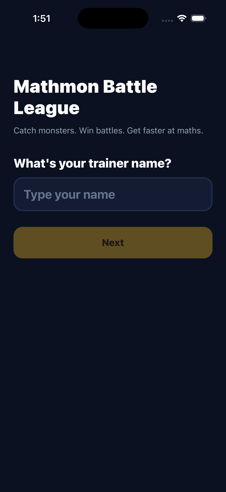

# Mathmon — iOS client

React Native on Expo SDK 57. The whole game — sign-up, dashboard, opponent
choice, battle, album, progress — running on the web app's engine rather than a
reimplementation of it.

## The shared engine is the point

`src/lib/game/` at the repository root is pure TypeScript: no React, no DOM, no
Node APIs, no `Math.random`, no `Date.now` inside the rules. That is what makes
it portable, so this client imports **the same modules** the web client uses:

```
src/lib/game/          ← one copy of the rules
├── consumed by src/app/        (Next.js, web)
└── consumed by mobile/src/engine.ts  (React Native, iOS)
```

A balance fix or a new creature reaches both clients at once, and the engine
tests at the repository root cover this client too.

Two pieces of plumbing make it work:

- **`metro.config.js`** declares `../src/lib` in `watchFolders`, because Metro
  only watches its own project root. Module resolution is pinned to
  `mobile/node_modules` so shared files cannot pick up a second copy of React
  from the web app's dependency tree.
- **`src/engine.ts`** is the only file that knows the path across the directory
  boundary. Everything else imports from it.

`src/engine.test.ts` guards the seam, including a check that no shared module
has grown a Node or browser dependency that would break under Hermes.

## What is native to this client

The creature art crosses the seam too. `src/lib/game/art.ts` emits primitive
shapes and gradients — no SVG, no DOM — and `src/ui/CreatureArt.tsx` maps them
onto `react-native-svg` in a 45-line switch. The web client's renderer is the
same switch against inline `<svg>`. Adding a creature or a new crown shape lands
on both clients with no port and no image.

Three things genuinely could not cross, and each is a substitution for a
platform API rather than a fork of a rule:

| Web                      | iOS                            | Why                                                                                           |
| ------------------------ | ------------------------------ | --------------------------------------------------------------------------------------------- |
| `localStorage`           | `AsyncStorage`                 | Same key, same `normaliseProfile` repair at the boundary.                                     |
| Web Audio cues           | Taptic Engine (`expo-haptics`) | Reads better in one hand, and needs no audio assets — the no-bundled-media property survives. |
| `prefers-reduced-motion` | `AccessibilityInfo`            | iOS does not honour it for free; the hit shake asks explicitly.                               |

Navigation is a `switch` in `App.tsx`, not React Navigation. Eight screens, one
deep link (`mathmon://screen/<name>`, which the screenshot harness drives and
which can do nothing a button cannot), no back stack worth preserving — a
navigation library would add two
more native modules to the iOS build to replace ten lines.

### When the game trips over

The engine throws on invalid data on purpose, and repairs it at the boundary
instead. That is the right call, and it means a render here _can_ throw. On the
web that would be a blank white page and `src/app/error.tsx` catches it; React
Native has no `error.tsx`, and an uncaught render error is worse — the tree
unmounts, and in the **Release** build that ships to the phone the child gets a
blank screen and then a dead app. No message, no way back, and usually no adult
beside him who knows what happened.

`src/CrashBoundary.tsx` is the counterpart: a class boundary in `App.tsx`
wrapping `GameProvider` and the router, so a crash while reading or reconciling
the save is caught too. It shows the same screen the web client shows, in the
same words from the same `STRINGS` table — it is not his fault, nothing was
lost — with a big "try again" and a way home.

What it offers, and when, is not decided twice. `recoveryPlan` and
`languageFromSave` live in `src/lib/recovery.ts` and cross the seam like any
other rule, because they _are_ rules: **the screen never erases the save on its
own.** The destructive option is not even rendered on the first crash. It
appears only once a retry has demonstrably failed, and then still takes two more
taps behind a sentence naming what it costs. Losing the album is worse than the
crash, and `src/CrashBoundary.test.tsx` crashes the boundary with a real engine
throw — `getCreature` on an id the roster does not have — to prove the save is
still on the device afterwards, including after a failed retry.

Two details are this client's rather than the web's. The current screen is held
above the boundary in `App.tsx`, so "try again" remounts the subtree on the
screen that crashed while "home" resets the screen first — with no URL to return
to, they would otherwise be the same button twice. And erasing ends in a
remount of everything below the boundary, which is this client's
`window.location.reload()`: a fresh `GameProvider` reads the now-empty device
and the game starts at sign-up.

Nothing on that screen animates, which is the reduced-motion path taken to its
end rather than a gap in it — a screen with no motion cannot get
`AccessibilityInfo.isReduceMotionEnabled()` wrong, and a spinner would only make
a frightening moment busier.

## Commands

```bash
npm install
npm run typecheck
npm test           # engine seam, art port, storage, battle flow, API contract
npm run bundle     # real Metro bundle for iOS, runs anywhere including Linux
npm run ios        # needs macOS + Xcode
```

`npm run bundle` is the most useful check off a Mac: it compiles the whole app,
shared engine included, to Hermes bytecode and fails on any bad import.

## Backend

The game is fully playable with no network: the profile lives on the device,
exactly as the web client behaves with no database attached. Signing in is an
**upgrade, never a gate** — the device save is always what the game plays from,
so a flat network or no account at all costs a child nothing. An account only
mirrors that save so his album follows him to another device.

Sign-in is a trainer name and a four-digit PIN, the same accounts the web client
uses, resolved by the same `reconcile` in the engine — which merges what was
earned (album, badges, records, lifetime counters) and only falls back to
last-write-wins on `updatedAt` for mutable state, so playing offline on the
phone can never cost him what he caught on the laptop. The
session is an httpOnly cookie; React Native's fetch uses the platform cookie
store, so this client never sees or stores a credential itself.

The base URL is build-time configuration, never hardcoded:

```bash
EXPO_PUBLIC_API_URL=https://your-deployment.vercel.app npm run bundle
```

### Testing against a real server

`api.test.ts` stubs `fetch` and covers the bad-network cases. What a stub cannot
cover is whether the requests this client sends are the ones the routes actually
accept — a mock agrees with whatever it was written to expect, which is how a
client and a server drift apart. `api.live.test.ts` therefore talks to a running
server, and skips itself unless one is offered:

```bash
cd ..                                   # the repo root serves the API
DATABASE_URL=postgres://... npm run build
DATABASE_URL=postgres://... npm start

cd mobile
TEST_API_URL=http://127.0.0.1:3000 npm test
```

It earned its place immediately: the first draft used a 23-character trainer
name and every request came back `invalid`, because the server allows 2-16. A
mocked fetch would have accepted it happily.

## Building and signing

All macOS work happens on GitHub Actions (`.github/workflows/ios.yml`), not on
a developer machine.

**Today, with no credentials at all**, the `simulator` job on `macos-26` runs
`expo prebuild`, `pod install` and `xcodebuild`, then boots a simulator to
install, launch and screenshot the app. Simulator builds need no Apple
Developer account, so this is free and runs on every push.

Three things about that job are load-bearing, and each one was added after a
green run that had proven nothing:

- **It builds Release, not Debug.** React Native's bundle script phase skips
  bundling for a simulator Debug build, because it assumes Metro is serving on
  localhost. Nothing serves in CI, so a Debug build ships an app containing no
  JavaScript. It installs, launches, stays alive, and displays the "No script
  URL provided" redbox. Release embeds the Hermes bytecode bundle, which is
  also what actually ships.
- **It asserts `main.jsbundle` is inside the `.app`** before launching, which
  is the direct guard against the above.
- **It reads the pixels back.** `scripts/assert-screenshot-text.swift` runs
  Vision OCR over the screenshot and requires the app's own strings to be on
  it. "The process is still alive" is a weak claim: a redbox is alive, and so
  is a blank screen. Only the OCR distinguishes _running_ from _working_.

The runner image matters: Expo SDK 57 ships a Swift package declaring
`swift-tools-version 6.2`, so the build needs Xcode 26 or newer. On the
`macos-15` image (Xcode 16.4 / Swift 6.1) SwiftPM refuses to resolve it, six
minutes into the build, inside a CocoaPods script phase. The workflow now
asserts the Swift version up front so that failure is immediate and legible.

**For a signed build**, add an `EXPO_TOKEN` repository secret
([expo.dev](https://expo.dev) → account → access tokens). The `signed-build`
job skips itself until that exists. EAS provisions and stores the certificate
and provisioning profile itself, so **no `.p12`, no private key and no
provisioning profile is ever committed to this repository**.

Before the first signed build you also need:

| What                               | Where                                         | Why                                                                              |
| ---------------------------------- | --------------------------------------------- | -------------------------------------------------------------------------------- |
| Apple Developer Program membership | developer.apple.com                           | Required for any signed build                                                    |
| Bundle identifier                  | `app.json` → `ios.bundleIdentifier`           | Currently `com.pfeilbr.mathmon`; change before first submission, it is permanent |
| App Store Connect app ID           | `eas.json` → `submit.production.ios.ascAppId` | Only needed for `eas submit`                                                     |

`eas build` will prompt to create the certificate and profile on first run and
reuse them afterwards.

## Status



That screenshot is not a mockup. It was captured on a GitHub macOS runner from
a Release build with the JavaScript bundle embedded, and Vision OCR read the
words back off it before it was accepted.

### The visual record

`mobile/docs/screens/` is this client's answer to the web app's
`docs/screenshots/`, and it is captured the same way: by driving the real app,
never by hand.

`mobile/scripts/capture_screens.sh` takes a booted simulator and a built
`.app`, walks the app through its screens, photographs each one and asserts the
screen's own words are in the pixels before accepting the capture. It seeds a
save straight into the app's AsyncStorage container - the same profile the web
screenshots use - and then selects each screen with a deep link
(`mathmon://screen/album`), because `simctl` can open a URL and cannot tap. That
link is the one hook this puts in shipping code, and it can do nothing a button
cannot: it selects a screen, and deliberately cannot carry state. A deep link
that could overwrite a child's album would be a real hole, and it would live in
the app forever to save a harness twenty lines - which is why the save is seeded
through the filesystem instead.

| Capture                | Screen                                                      |
| ---------------------- | ----------------------------------------------------------- |
| `01-sign-up`           | Trainer name, on a device with no save at all               |
| `02-dashboard`         | Partner in its evolved form, XP bar, maths level, streak    |
| `03-choose-opponent`   | Three opponents with the net matchup verdict                |
| `04-battle`            | The fight, mid-turn, with the move kit and the charge meter |
| `05-album`             | All 36 creatures by element, un-caught ones as silhouettes  |
| `06-progress`          | Badges, and per-skill accuracy and average time             |
| `07-settings`          | Language, sound, account, start over                        |
| `08-sign-in`           | Trainer name and PIN                                        |
| `09-chinese-dashboard` | The dashboard in 中文                                       |
| `10-chinese-album`     | The album in 中文                                           |

The last two are seeded from a profile identical to the English one except for
`settings.language`. That is deliberate: if the translation ever stopped
applying, those files would be byte-identical to `02` and `05`, and the audit
below fails on exactly that. It is the bug the web client actually shipped -
`12-chinese.png` was a copy of an English dashboard for weeks, with a green
test suite over it.

Only `01-sign-up.png` is committed today. The other nine need a macOS runner:
run the **Capture the app's screens** job, download the `ios-screens` artifact
and commit it. `mobile/scripts/audit_ios_screenshots.py` names every screen that
is still missing on every run, so an incomplete record says so out loud rather
than being something you have to notice.

That audit is the cheap half, and it runs on every push with no simulator, no
Xcode and no build. It decodes each committed PNG with `zlib` and `struct` and
checks the set is decodable, phone-sized and all one device, not blank, not two
names for one picture, and painted on this app's own background. The last one is
the redbox check: a redbox is a running app on a red screen, the springboard is
a running device with the wrong app on it, and both photograph beautifully.
Neither paints `#0b1120` over most of the display.

The game is complete and playable on the device:

- **Sign-up** — trainer name, then the twelve starters on their own screen.
- **Accounts** — optional name + PIN sign-in from Settings, mirroring progress
  to the same server the web client uses.
- **Dashboard** — partner in its current evolved form, XP bar, maths level,
  day streak, album completion.
- **Opponent choice** — three level-appropriate opponents, each labelled with
  the net matchup verdict, and the whole element wheel one tap away.
- **Battle** — four-move kit, on-screen keypad, the draining speed meter,
  combo and charge, the catch question, then a result screen that names the
  XP, the level-up, the evolution and each new badge by name.
- **Album** — all 36 creatures grouped by element, un-caught ones as silhouettes.
- **Progress** — badges, and per-skill maths accuracy and average time.
- **Crash recovery** — if a render throws, a bilingual screen that says nothing
  was lost and offers a retry and a way home, instead of the blank screen a
  Release build would otherwise die on.
- **Settings** — the language toggle (English/中文), the sound switch, which on
  this client is the master switch for haptics too, and starting over. All three
  transitions are exported as pure functions and tested without a renderer, so
  the claim under test is "this changed one field of the save and nothing else".

  Starting over is the destructive one, so it is gated rather than offered. The
  resting control is the quietest thing on the screen — small, grey, unfilled,
  nothing about it inviting a tap — and all it can do is open a confirmation
  that names the cost in both languages, with a red Delete beside a Back. The
  gate itself is `nextReset`, a pure function of the current stage and the
  press, which turns "only one sequence of presses can reach the save" into a
  property `Settings.reset.test.ts` proves against a real profile rather than a
  comment: a `delete` that never passed through the confirmation returns
  `wipe: false` and does nothing at all. On a phone every control sits under a
  child's thumb, and the album is what he has been collecting for weeks.

  For a signed-in player it means _start over on this device_, never "erase my
  account". The session is dropped first, which flushes anything still queued to
  the server, so the last battle reaches the account before the phone forgets it
  and the fresh profile sign-up creates a minute later is not pushed over the
  old one. Only then is the device cleared, through `storage.ts` like every
  other write. What reached the account is still there to sign back into; no
  call on either client removes an account's copy, and `startOverPlan` says so
  in a field a test can read.

Not yet here: Google sign-in (the web client offers it; this one is PIN only)
and background refresh — the server is read on launch and on sign-in, not while
the app is open.

The crash screen's erase is the other way back to a clean beginning, and it is
deliberately shaped differently: unreachable until the app has actually broken,
invisible until a retry has failed, and two taps and a named cost after that. It
is a last resort a stuck child can be walked to. Settings is the door he can
find on purpose.

`mobile/scripts/audit_parity.py` checks that list against the web client: a
screen or feature that exists there and not here has to be named in this
paragraph, or the audit fails. A gap is allowed to be a decision; it is not
allowed to be an accident.
